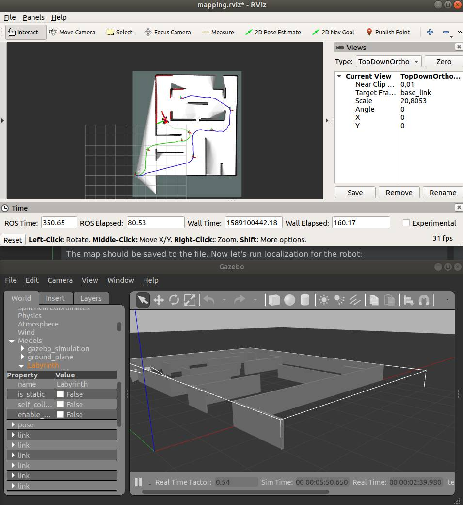

# About

ToDo

# Dependencies

```
sudo apt install ros-melodic-cartographer 
sudo apt install ros-melodic-cartographer-ros 
sudo apt install ros-melodic-cartographer-rviz
```

# How to run

### How to run cartographer in online mode

Run simulation:

    roslaunch gazebo_simulation world_of_labyrinth.launch

in another terminal run mapping 

    roslaunch cartographer_slam carto_slam_online_mapping.launch
    
Move your robot around the map. When you are ready run

    rosservice call /finish_trajectory 0
    rosservice call /write_state ~/c4_map.bag.pbstream

In case you are using a newer version of cartographer the later command should have different syntax.
Refer to the docs for details.

Kill mapping, rerun simulation.

The map should be saved to the file. Now let's run localization for the robot:

    roslaunch cartographer_slam carto_slam_online_localization.launch load_state_filename:=`realpath ~/c4_map.bag.pbstream`
    
RViz should show the loaded map. The moving robot should be localized in the map.




# Useful links

ToDo