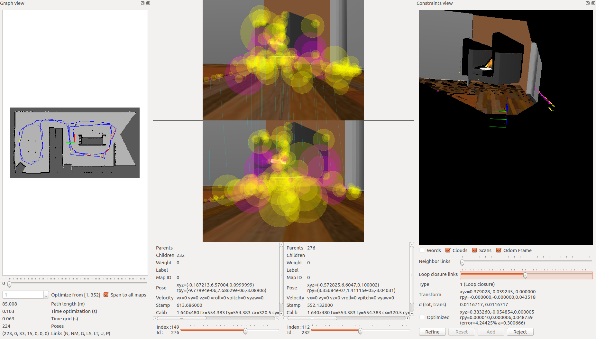

# About

Took from here: <a href="http://introlab.github.io/rtabmap/">RTAB official page</a>.

RTAB-Map (Real-Time Appearance-Based Mapping) is a RGB-D, Stereo and Lidar Graph-Based SLAM approach based on an incremental appearance-based loop closure detector. The loop closure detector uses a bag-of-words approach to determinate how likely a new image comes from a previous location or a new location. When a loop closure hypothesis is accepted, a new constraint is added to the map’s graph, then a graph optimizer minimizes the errors in the map. A memory management approach is used to limit the number of locations used for loop closure detection and graph optimization, so that real-time constraints on large-scale environnements are always respected. RTAB-Map can be used alone with a handheld Kinect, a stereo camera or a 3D lidar for 6DoF mapping, or on a robot equipped with a laser rangefinder for 3DoF mapping.

# Dependecies

```
sudo apt install ros-melodic-rtabmap
sudo apt install ros-melodic-rtabmap-ros
```

# How to run

Download the Rosbag from <a href="https://drive.google.com/uc?export=download&confirm=wwQS&id=0B46akLGdg-uaa1dDSlUwWUsyTzQ">here</a>.

Install the package and start ROS.

```
mkdir -p catkin_ws/src
git clone https://github.com/project-omicron/slam.git
cd ..
catkin_make
source devel/setup.bash
roscore
```

Go to the directory you unpacked the rosbag and play the bag.

```
rosbag play map1.bag
```


In another terminal start the RTab-SLAM, the script will gebnerate the map.

```
roslaunch rtab_slam mapping.launch
```

# RTab Database Analysis

The rtabmap-databaseViewer is a great tool for exploring your database when you are done generating it. It is isolated from ROS and allows for complete analysis of your mapping session.

This is how you will check for loop closures, generate 3D maps for viewing, extract images, check feature mapping rich zones, and much more! 

```
rtabmap-databaseViewer ~/.ros/rtabmap.db
```

<p align="center">
  
</p>

Once open, we will need to add some windows to get a better view of the relevant information, so:

- Say yes to using the database parameters
- View -> Constraint View
- View -> Graph View

Those options are enough to start, as there are many features built into the database viewer!

Let’s talk about what you are seeing in the above image. On the left, you have your 2D grid map in all of its updated iterations and the path of your robot. In the middle you have different images from the mapping process. Here you can scrub through images to see all of the features from your detection algorithm. These features are in yellow. Then, what is the pink, you may ask? The pink indicates where two images have features in common and this information is being used to create neighboring links and loop closures! Finally, on the right you can see the constraint view. This is where you can identify where and how the neighboring links and loop closures were created.

<p align="center">
  
</p>

You can see the number of loop closures in the bottom left. The codes stand for the following: Neighbor, Neighbor Merged, Global Loop closure, Local loop closure by space, Local loop closure by time, User loop closure, and Prior link.

When it comes time to design your own environment, this tool can be a good resource for checking if the environment is feature-rich enough to make global loop closures. A good environment has many features that can be associated in order to achieve loop closures.


# Useful links

- http://introlab.github.io/rtabmap/
- http://wiki.ros.org/rtabmap_ros/Tutorials/SetupOnYourRobot
- http://wiki.ros.org/rtabmap_ros
- http://wiki.ros.org/rtabmap_ros/Tutorials/Advanced%20Parameter%20Tuning
- https://github.com/introlab/rtabmap/blob/master/corelib/include/rtabmap/core/Parameters.h
- https://github.com/introlab/rtabmap_ros/blob/master/launch/rtabmap.launch